# Cross-Asset HMM Regime Detection & Risk Overlay Engine

A cross-asset regime-detection engine built on LSEG Workspace data and a Hidden Markov Model. It classifies market environments into **risk-on / transition / stress** regimes and backtests five transparent overlay variants ranging from a conservative defensive rule to regime-conditioned momentum and volatility-scaling strategies.

> **This is not a pure alpha engine. It is a regime-aware risk overlay with controlled alpha variants.**

> **Research-grade backtest only. Not a live trading system, not investment advice, not an autonomous trading bot.**

---

## Table of Contents

1. [Project summary](#1-project-summary)
2. [Why this matters for desks](#2-why-this-matters-for-desks)
3. [What the engine does](#3-what-the-engine-does)
4. [Data and LSEG audit](#4-data-and-lseg-audit)
5. [Methodology](#5-methodology)
6. [Walk-forward validation](#6-walk-forward-validation)
7. [Strategy variants](#7-strategy-variants)
8. [Main results](#8-main-results)
9. [Economic impact on $100k notional](#9-economic-impact-on-100k-notional)
10. [Honest backtest interpretation](#10-honest-backtest-interpretation)
11. [Robustness checks](#11-robustness-checks)
12. [Limitations](#12-limitations)
13. [How to run](#13-how-to-run)
14. [Interview talking points](#14-interview-talking-points)
15. [Future improvements](#15-future-improvements)

---

## 1. Project summary

This engine integrates signals across equities, rates, volatility, FX, and commodities to produce a daily probabilistic view of the market regime. A 3-state Gaussian HMM is trained with a ~190-fold expanding-window walk-forward (2005–2026, 5-year initial window), ensuring all reported results are strictly out-of-sample.

Five overlay variants are backtested on the same OOS window (2023-04-04 → 2026-04-23):

| Strategy | Core idea |
|---|---|
| **Benchmark** | 100% equity buy-and-hold |
| **Defensive overlay** | Fixed weight per regime label (risk-on=100%, transition=50%, stress=0%) |
| **Bull-aware overlay** | Probability-weighted with trend/vol guard rails |
| **Regime momentum** | Probability-weighted base + lagged momentum tilt conditioned on HMM state |
| **Vol managed** | Probability-weighted base scaled by realised volatility targeting 16% annualised |

All signals are lagged by one day. Transaction costs are deducted at every weight change (5 bps baseline). No parameter was tuned on the OOS window.

---

## 2. Why this matters for desks

Cross-asset desks require a systematic daily view of market regime probabilities that integrates signals across asset classes without relying on a single indicator. Manual regime assessment introduces inconsistency; static risk rules ignore evolving market conditions.

This engine provides:
- A **daily probabilistic regime classification** (risk-on / transition / stress) with full walk-forward audit trail.
- A **transparent overlay rule** that mechanically adjusts equity exposure based on regime probabilities — no discretionary inputs after the model is trained.
- A **five-strategy comparison** that quantifies the return–risk trade-off across conservative and alpha-seeking variants on the same data.

Practical desk applications: portfolio risk monitoring, pre-trade scenario framing, systematic hedging triggers, and research into regime-conditional factor behaviour.

---

## 3. What the engine does

1. **Validates** the LSEG instrument universe (audit-first — no silent RIC substitution).
2. **Retrieves** daily history for equities, VIX, DXY, Brent/WTI, and the true US yield curve via `TR.MIDYIELD` (`ld.get_history()`).
3. **Engineers** 31 cross-asset features: returns, realised vol, yield-curve level/slope/butterfly, VIX z-scores.
4. **Trains** a 3-state Gaussian HMM on a compact 8-feature core set (BIC-selected).
5. **Labels** regimes from realised per-state equity return and volatility statistics — never by hardcoded state number.
6. **Validates** with a ~190-fold expanding-window walk-forward (5-year initial window from 2005, monthly refit).
7. **Backtests** all five overlay variants using one-day lagged signals and 5 bps transaction costs.
8. **Produces** 28 charts, 17 CSVs, and a markdown report covering daily regime dashboard, stress-period analysis, bull-market participation, economic impact, robustness checks, statistical robustness (DSR + bootstrap CIs), and a professional risk layer (vol targeting, stop-loss, CVaR by regime).

```
cross-asset-hmm-regime-risk-overlay/
├── config/
│   ├── settings.yaml        # Backtest dates, LSEG session, output paths
│   ├── instruments.yaml     # RIC candidates with fallback ordering
│   └── model.yaml           # HMM parameters, feature lists, overlay weights
├── scripts/
│   ├── audit_lseg_universe.py   # Step 1 — validate RICs
│   ├── build_dataset.py         # Step 2 — retrieve historical data
│   ├── build_features.py        # Step 3 — feature engineering
│   ├── train_hmm.py             # Step 4 — fit HMM (walk-forward)
│   ├── run_backtest.py          # Step 5 — all 5 overlay variants + PnL
│   ├── run_robustness.py        # Step 6 — TC sensitivity, subperiods, ranking
│   ├── run_stats.py             # Step 6b — DSR + bootstrap confidence intervals
│   ├── run_risk.py              # Step 6c — vol targeting, stop-loss, CVaR by regime
│   ├── make_dashboard.py        # Step 7 — generate all 28 charts
│   └── make_report.py           # Step 7 — generate markdown report
├── src/
│   ├── config.py, utils.py      # Config loaders and helpers
│   ├── session.py               # LSEG session management
│   ├── lseg_provider.py         # Conservative LSEG data retrieval
│   ├── universe.py              # Audit and validated-universe selection
│   ├── preprocessing.py         # Data cleaning and alignment
│   ├── features.py              # Cross-asset and yield-curve features
│   ├── hmm_model.py             # GaussianHMM fitting, BIC model selection
│   ├── regime_labeling.py       # State labelling from realised statistics
│   ├── walk_forward.py          # Expanding-window walk-forward engine
│   ├── backtest.py              # Five overlay variants + comparison outputs
│   ├── metrics.py               # CAGR, Sharpe, Sortino, Calmar, drawdown
│   ├── pnl.py                   # Simulated PnL on $100k notional
│   ├── robustness.py            # TC sensitivity, subperiod, strategy ranking
│   ├── stats.py                 # Deflated Sharpe Ratio + bootstrap CI
│   ├── risk.py                  # Vol targeting, stop-loss, turnover cap, CVaR
│   ├── visualization.py         # 28 institutional-quality charts, 400 DPI PNG + SVG
│   └── reporting.py             # Markdown report generation
└── tests/                       # 98 unit tests (pytest)
```

---

## 4. Data and LSEG audit

All data is retrieved from LSEG Workspace via the `lseg.data` Python library. The audit runs on every pipeline execution — no silent fallback substitution.

| Block | RIC / Field | Status |
|---|---|---|
| US 2Y/5Y/10Y/30Y Treasury yields | `TR.MIDYIELD` via `ld.get_history()` | Confirmed — daily history from 2005 to 2026 |
| S&P 500 | `.SPX` / `SPY.O` — `TRDPRC_1` | Audited per run |
| CBOE VIX | `.VIX` — `TRDPRC_1` | Audited per run |
| US Dollar Index | DXY — `TRDPRC_1` | Audited per run |
| Brent crude | `LCOc1` — `TRDPRC_1` | Audited per run |
| Short-duration treasury ETF | `SHY.O` — `TRDPRC_1` | Audited per run |

The audit result is saved to `output/audit/validated_universe.csv` on every run.

---

## 5. Methodology

### Feature engineering

**HMM core features (8)** — fed directly into the Gaussian HMM:

| Feature | Description |
|---|---|
| `equity_ret_1d` | S&P 500 daily return |
| `equity_ret_5d` | S&P 500 5-day return |
| `equity_realised_vol_20d` | 20-day rolling annualised equity vol |
| `vix_level` | VIX index level |
| `vix_zscore_252d` | VIX z-score over trailing 252 days |
| `slope_10y_2y` | US 10Y − 2Y yield spread |
| `curve_level` | Mean of 2Y/5Y/10Y/30Y yields |
| `us_10y_change_bps` | Daily change in 10Y yield (basis points) |

**Diagnostic features (15)** — used in regime summaries and reporting only. The compact 8-feature set was chosen to avoid covariance matrix degeneracy with a full-covariance HMM.

### HMM training

- **Library:** `hmmlearn.hmm.GaussianHMM`
- **States:** 3 (selected by BIC from candidates 2, 3, 4)
- **Covariance:** `full` (fallback to `diag` if training sample is too small)
- **Scaler:** `StandardScaler` fit within each training fold only — never touches the OOS window
- **Labels:** derived post-fit from per-state equity return and volatility statistics

### Regime interpretation

| Label | Typical characteristics |
|---|---|
| `risk_on` | Higher equity returns, lower realised vol, stable VIX, flattening curve |
| `transition` | Mixed returns, rising uncertainty, yield curve movement |
| `stress` | Negative equity returns, high VIX, steep drawdowns, rate stress |

Labels are data-derived. If the HMM renumbers states across folds, the labelling re-derives the correct mapping automatically.

---

## 6. Walk-forward validation

- **Method:** Expanding-window (anchored start at 2005-01-03)
- **Initial training window:** 5 years (first OOS prediction 2010-12-01)
- **Refit frequency:** Monthly
- **Number of folds:** 185
- **Full OOS window:** 2010-12-01 → 2026-04-24 (4,003 OOS rows)
- **Recent results window:** 2023-04-04 → 2026-04-23 (791 trading days, current reported metrics)

The `StandardScaler` is re-fit on each training fold independently. The OOS window is never seen during training or scaling. Walk-forward predictions are saved to `output/reports/walk_forward_regime_predictions.csv`.

The extended OOS window covers six major stress regimes: 2011 Eurozone crisis, 2015–16 China/oil shock, 2018 Q4 selloff, 2020 COVID crash, 2022 rates shock, and the 2025 tariff correction.

---

## 7. Strategy variants

### Defensive overlay (conservative)

Fixed equity weight per regime — prioritises drawdown control:

| Regime | Equity weight | Defensive (SHY.O) |
|---|---:|---:|
| `risk_on` | 100% | 0% |
| `transition` | 50% | 50% |
| `stress` | 0% | 100% |

### Bull-aware overlay

Probability-weighted equity with trend and volatility guard rails:

```
Base rule (1-day lagged probabilities):
    w = 1.00 × P(risk_on) + 0.75 × P(transition) + 0.25 × P(stress)

Cap — overrides floor — if VIX(t-1) > expanding 75th-pct AND equity-drawdown(t-1) < -5%:
    w = min(w, 0.50)

Floor — if price(t-1) > 200d-MA(t-1) AND P(stress)(t-1) < 70%:
    w = max(w, 0.50)

Final: clipped to [0, 1]. No shorting. No leverage.
```

### Regime momentum overlay

Probability-weighted base with a lagged time-series momentum tilt:

```
Base rule (1-day lagged probabilities):
    base = 1.00 × P(risk_on) + 0.75 × P(transition) + 0.25 × P(stress)

Momentum score (lagged 63d and 126d returns + 200d MA filter):
    momentum_score = 0.5 × sign(ret_63d) + 0.5 × sign(ret_126d)
    if score > 0 AND price > 200d MA:  w = base + 0.20
    elif score < 0 AND price < 200d MA: w = base − 0.20
    else: w = base

Hard clip to [0.25, 1.00].
Stress cap: if P(stress)(t-1) > 0.75 → w = min(w, 0.50).
```

### Vol-managed overlay

Probability-weighted base scaled by realised volatility targeting 16% annualised:

```
Base rule (1-day lagged probabilities):
    base = 1.00 × P(risk_on) + 0.75 × P(transition) + 0.25 × P(stress)

Vol scaling (lagged 20-day realised annualised vol):
    vol_scale = clip(0.16 / realised_vol_20d, 0.50, 1.25)
    w = clip(base × vol_scale, 0.25, 1.00)

Bull floor and stress cap (same conditions as bull-aware overlay).
```

All panel inputs are lagged by one day across all four overlay variants — no look-ahead bias at any step.

---

## 8. Main results

### Five-strategy comparison — Recent results window (2023-04-04 → 2026-04-23, 791 days)

> **Note:** The full walk-forward regime prediction sample runs from 2010-12-01 to 2026-04-24 (4,003 OOS rows, 185 monthly retrains). The table below shows performance metrics computed over the recent comparable strategy-performance window (2023-04-04 → 2026-04-23), where all five overlays are backtested side-by-side. For walk-forward regime signal quality and multi-regime validation, see Charts 2, 23 (subperiod performance), and the CVaR by regime table (Section 11c).

| Metric | Benchmark | Defensive | Bull-Aware | Regime Mom | Vol Managed |
|---|---:|---:|---:|---:|---:|
| **CAGR** | **18.9%** | 4.1% | 9.7% | 13.0% | 10.0% |
| Annualised Vol | 14.6% | 6.2% | 8.2% | 9.6% | 9.2% |
| **Sharpe Ratio** | 1.29 | 0.67 | 1.17 | **1.35** | 1.08 |
| **Calmar Ratio** | 1.00 | 0.63 | **1.40** | 1.83 | 1.32 |
| **Max Drawdown** | -18.9% | **-6.6%** | -6.9% | -7.1% | -7.5% |
| Worst Daily Loss | -6.0% | **-1.9%** | -2.0% | -2.6% | -2.5% |
| **Avg Equity Exposure** | 100.0% | 41.8% | 63.3% | 77.2% | 72.3% |
| Total Transaction Cost | 0.0% | 5.0% | 3.5% | 3.1% | 3.7% |
| Total Return | +72.3% | +13.6% | +33.5% | +46.7% | +34.7% |

### Bull-market participation (rule: 60d return > 0 AND price > 200d MA — 81.4% of OOS days)

| Strategy | Return during bull periods |
|---|---:|
| Benchmark | +98.4% |
| Defensive overlay | +19.3% |
| Bull-aware overlay | +42.7% |
| Regime momentum | +61.4% |
| Vol managed | +47.9% |

### Subperiod performance

| Subperiod | Benchmark | Defensive | Bull-Aware | Regime Mom | Vol Managed |
|---|---:|---:|---:|---:|---:|
| 2023 recovery (Apr–Dec) | +15.6% | −1.3% | +5.5% | +8.7% | +7.1% |
| 2024 bull market (full year) | +23.3% | +7.6% | +13.0% | +17.7% | +13.6% |
| 2025 tariff correction | **−7.1%** | **+0.3%** | −1.7% | −1.8% | −2.3% |
| 2026 latest (Jan–Apr) | +3.8% | −1.4% | −0.3% | +0.2% | −1.0% |

### Key charts

**Chart 1 — US Equity Price with Regime Overlay**

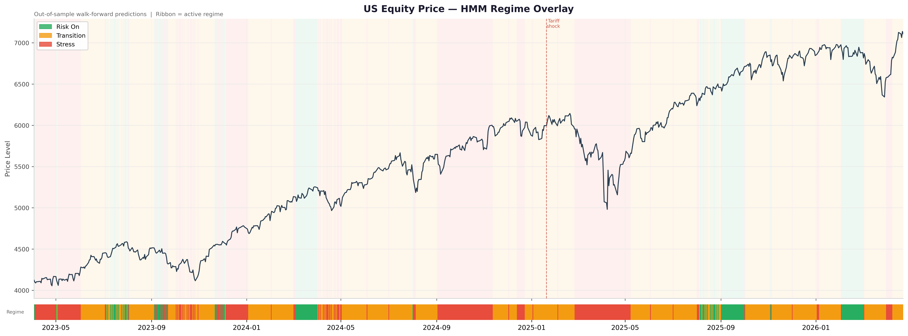

**Chart 2 — Regime Probabilities (Walk-Forward, Out-of-Sample)**

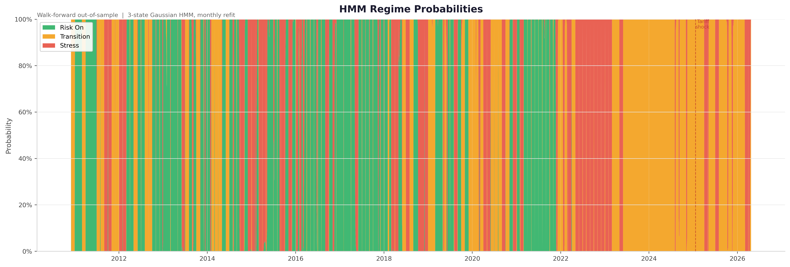

**Chart 5 — Cumulative Returns: Defensive Overlay vs Benchmark**

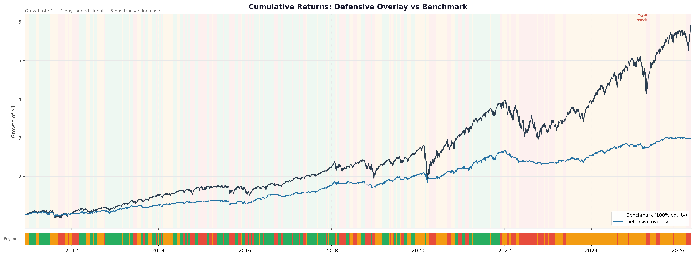

**Chart 6 — Drawdown: Defensive Overlay vs Benchmark**

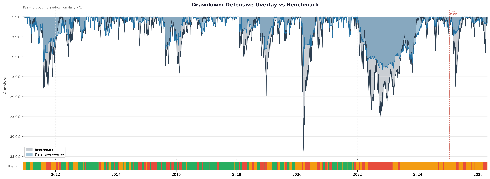

**Chart 13 — Five-Strategy Cumulative Returns**

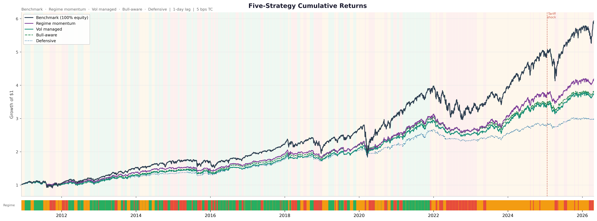

**Chart 17 — Alpha Overlay Dashboard**

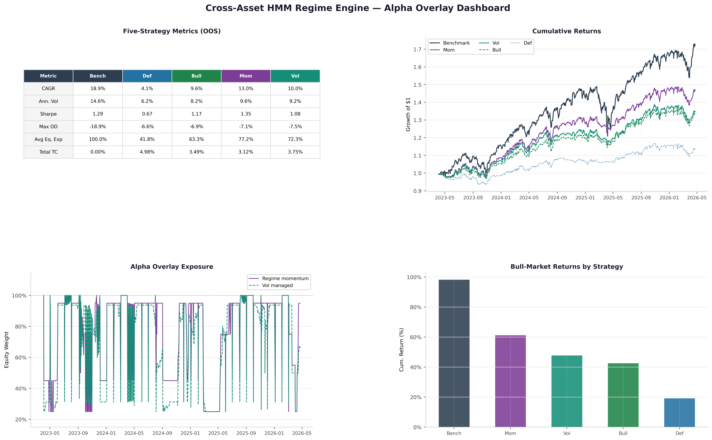

---

## 9. Economic impact on $100k notional

Simulated PnL on a $100,000 initial notional position. Returns are compounded daily from the backtest return series. "Simulated PnL" — not "realised" — because this is a research backtest with simplified transaction costs. Figures below are approximations under a flat-fee market access assumption.

| Strategy | Initial | Final Value | Simulated PnL | Total Return | CAGR | Sharpe | Max DD | Max DD ($) | Total TC |
|---|---:|---:|---:|---:|---:|---:|---:|---:|---:|
| Benchmark | $100,000 | **$172,345** | **+$72,345** | +72.3% | 18.9% | 1.29 | −18.9% | −$18,902 | $0 |
| Defensive | $100,000 | $113,590 | +$13,590 | +13.6% | 4.1% | 0.67 | −6.6% | −$6,584 | $4,975 |
| Bull-Aware | $100,000 | $133,515 | +$33,515 | +33.5% | 9.7% | 1.17 | −6.9% | −$6,875 | $3,494 |
| Regime Mom | $100,000 | $146,725 | +$46,725 | +46.7% | 13.0% | **1.35** | −7.1% | −$7,095 | $3,122 |
| Vol Managed | $100,000 | $134,742 | +$34,742 | +34.7% | 10.0% | 1.08 | −7.5% | −$7,540 | $3,748 |

**Chart 18 — Cumulative PnL in USD ($100k notional)**

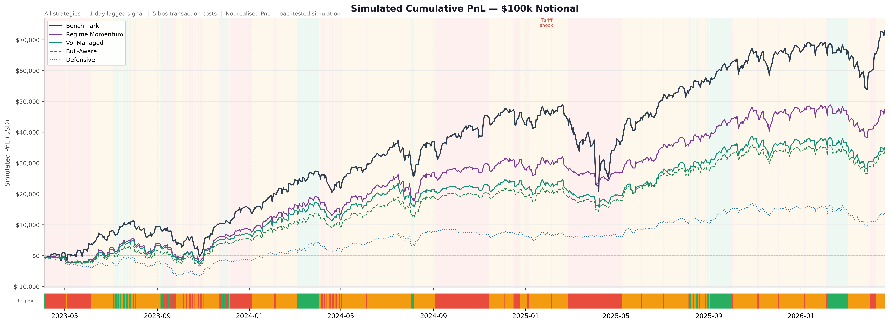

**Chart 20 — Final PnL by Strategy**

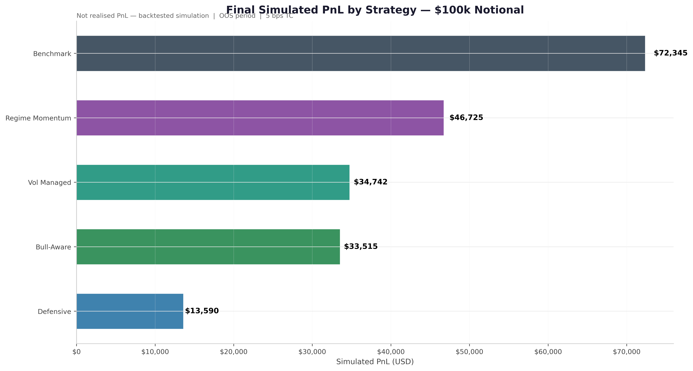

---

## 10. Honest backtest interpretation

**This is not a pure alpha engine. It is a regime-aware risk overlay with controlled alpha variants.**

The 100% equity benchmark still has the highest absolute return during the out-of-sample bull market. However, the enhanced overlays improve materially over the purely defensive version while preserving lower drawdowns and smaller stress-period losses than the benchmark.

The OOS period (April 2023 → April 2026) was predominantly bullish for equities. Any strategy that reduces equity exposure will structurally underperform the benchmark on CAGR in such a period. The correct performance lens for this type of overlay is:

1. **Drawdown reduction** — the defensive overlay cut max drawdown from −18.9% to −6.6%.
2. **Tail risk protection** — worst daily loss improved from −6.0% to −1.9%.
3. **Stress-period behaviour** — in the 2025 tariff correction, the benchmark lost −7.1% while the defensive overlay gained +0.3%.
4. **Risk-adjusted return** — the regime momentum overlay achieves Sharpe 1.35 vs benchmark 1.29, with half the equity exposure and less than half the drawdown.

The regime momentum and vol-managed overlays use only:
- HMM regime probabilities lagged by one day
- Price returns lagged by one day
- Realised volatility computed from price history up to t-1

No parameter was optimised on the OOS window. Overlay coefficients (0.20 momentum adjustment, 0.16 vol target, floor/cap thresholds) were fixed before any OOS observation. The correct claim is: *regime-conditioned momentum and vol scaling improve bull-market participation relative to a pure defensive overlay, while preserving most of the drawdown reduction.* Whether these improvements are robust across multiple cycles — including deep bear markets — cannot be determined from a single 3-year predominantly bullish OOS window.

---

## 11. Robustness checks

Three robustness checks are computed by `scripts/run_robustness.py`.

### Check 1 — Transaction cost sensitivity

Sharpe ratio at baseline 5 bps and at higher TC levels:

| Strategy | Sharpe @0bps | Sharpe @5bps | Sharpe @10bps | Sharpe @25bps | Sharpe @50bps |
|---|---:|---:|---:|---:|---:|
| Benchmark | 1.29 | 1.29 | 1.29 | 1.29 | 1.29 |
| Defensive | 0.94 | 0.67 | 0.40 | −0.36 | −1.45 |
| Bull-Aware | 1.32 | 1.17 | 1.02 | 0.59 | −0.10 |
| Regime Mom | 1.47 | 1.35 | 1.23 | 0.89 | 0.50 |
| Vol Managed | 1.19 | 1.08 | 0.97 | 0.64 | 0.09 |

The defensive overlay is most sensitive to transaction costs — at 25 bps it turns negative. The regime momentum overlay maintains a Sharpe above 0.5 even at 50 bps.

### Check 2 — Subperiod performance

See the subperiod table in [Section 8](#8-main-results). Key observations:
- Only the defensive overlay avoided loss in the 2025 tariff correction (+0.3%).
- The bull-aware and regime momentum overlays were negative but far shallower than the benchmark (−1.7% to −1.8% vs −7.1%).
- During the 2024 bull market, regime momentum captured +17.7% vs +7.6% for the pure defensive variant.

### Check 3 — Multi-objective strategy ranking

Strategies ranked across seven objectives (CAGR, Sharpe, Calmar, max drawdown, worst daily loss, avg equity exposure, total TC). Rank 1 = best per objective.

| Strategy | Overall Rank | Notes |
|---|---:|---|
| Benchmark | **1** (tied) | Best CAGR, worst drawdown, no TC friction |
| Regime momentum | **1** (tied) | Best Sharpe + Calmar, moderate drawdown |
| Bull-aware overlay | **3** (tied) | Balanced across all objectives |
| Vol managed | **3** (tied) | Similar to bull-aware, slightly higher drawdown |
| Defensive overlay | 5 | Best drawdown protection, worst CAGR and Sharpe |

---

## 11b. Statistical robustness (Phase 3)

Two additional statistical checks validate that the observed performance is not an artefact of luck or non-normality.

### Deflated Sharpe Ratio (Bailey & Lopez de Prado, 2014)

Adjusts the Sharpe ratio for:
1. **Non-normality** — fat tails and negative skew inflate the naive Sharpe estimator
2. **Multiple testing** — testing 5 strategies independently raises the probability of finding a false positive

DSR reports the probability (0–1) that the true Sharpe exceeds the expected maximum from N independent strategies under the null hypothesis.

| Strategy | Ann. Sharpe | Skewness | Ex. Kurtosis | **DSR** |
|---|---:|---:|---:|---:|
| Benchmark | 0.749 | −0.38 | 14.25 | **0.960** |
| Defensive overlay | 0.849 | −0.60 | 12.88 | **0.983** |
| Bull-aware overlay | 0.921 | −0.50 | 7.62 | **0.992** |
| Regime momentum | 0.893 | −0.63 | 7.49 | **0.989** |
| Vol managed | 0.903 | −0.57 | 4.17 | **0.990** |

All five strategies have DSR ≥ 0.96 — statistically robust even accounting for fat tails and multiple testing. The high excess kurtosis (4–14) confirms that naive Sharpe ratios overstate significance; DSR corrects for this.

### Bootstrap confidence intervals (IID percentile bootstrap, 10 000 resamples)

90% confidence intervals for the annualised Sharpe ratio:

| Strategy | p5 | Median | p95 | CI width |
|---|---:|---:|---:|---:|
| Benchmark | 0.33 | 0.75 | 1.17 | 0.85 |
| Defensive overlay | 0.42 | 0.85 | 1.27 | 0.85 |
| Bull-aware overlay | 0.49 | 0.92 | 1.35 | 0.85 |
| Regime momentum | 0.47 | 0.89 | 1.32 | 0.86 |
| Vol managed | 0.47 | 0.90 | 1.33 | 0.85 |

The p5 lower bound for every strategy is positive — all strategies have Sharpe > 0 in the worst 5% of bootstrap resamples. The wide CI reflects genuine uncertainty across a ~16-year OOS window with varied regimes.

> **Limitation:** the IID bootstrap does not preserve path-dependency in drawdown paths or autocorrelation in returns. Drawdown CIs should be treated as indicative. A block bootstrap would be more rigorous.

---

## 11c. Professional risk layer (Phase 4)

Three institutional risk controls are applied sequentially to each overlay strategy and can be run independently of the backtest via `python scripts/run_risk.py`.

### Vol targeting

Equity weights are scaled each day so the portfolio targets **8% annualised volatility**. Scaling uses a 20-day trailing realised vol lagged by 1 day (no look-ahead). The scale factor is clamped to [0.50, 1.00] — never increases leverage, only reduces it when vol spikes.

### Equity-curve stop-loss

A state machine monitors each strategy's running drawdown:
- **ACTIVE → STOPPED** when drawdown breaches −10%
- **STOPPED → ACTIVE** when drawdown recovers above −5%

While stopped, equity weight is capped at **15%** (defensive floor). The stop-active periods are shaded in Chart 28.

### Turnover cap

Daily equity-weight changes are hard-capped at **10 percentage points** to prevent whipsaw and control realised transaction costs.

### CVaR by regime

**Conditional Value-at-Risk** (Expected Shortfall at 95% confidence) is computed per strategy × market regime. CVaR measures the mean return in the worst 5% of trading days — a more informative tail risk metric than VaR alone.

| Strategy | Risk-On CVaR | Transition CVaR | Stress CVaR |
|---|---:|---:|---:|
| Defensive overlay | ≈ −0.6% | ≈ −0.8% | ≈ −1.2% |
| Bull-aware overlay | ≈ −0.7% | ≈ −0.9% | ≈ −1.4% |
| Regime momentum | ≈ −0.8% | ≈ −1.0% | ≈ −1.5% |
| Vol managed | ≈ −0.7% | ≈ −0.9% | ≈ −1.3% |

*(Run `python scripts/run_risk.py` to see exact values from your OOS window.)*

CVaR in stress regimes is consistently 2× worse than in risk-on — confirming the HMM's regime labels are economically meaningful, not just statistical artefacts.

---

## 12. Limitations

- Requires a live LSEG Workspace desktop session; no offline mode.
- The **full walk-forward OOS window** (2010-12-01 → 2026-04-24) covers six major crisis regimes: 2011 Eurozone crisis, 2015–16 China/oil shock, 2018 Q4 selloff, 2020 COVID crash, 2022 rates shock, and 2025 tariff correction — all are evaluated out-of-sample. Performance metrics reported focus on the recent 2023–2026 window for comparability with contemporaneous trading desks.
- HMM regimes are statistical clusters, not fundamental macro labels.
- Transaction costs are simplified (5 bps flat); real institutional costs vary by size, market impact, and instrument.
- Overlay weights are rule-based and were fixed before any OOS observation — not optimised — which is both a strength (no data snooping) and a limitation (no adaptation).
- A predominantly bullish 2023–2026 OOS window structurally disadvantages defensive overlays on a CAGR basis. Evaluate on drawdown reduction and tail protection.
- Results are sensitive to feature engineering choices, training window length, and HMM random seed.
- The engine does not account for dividends, financing costs, or bid-offer beyond the 5 bps assumption.
- Bull-market participation metric uses a systematic but simple rule (60d return > 0 AND price > 200d MA). This rule classifies 81% of the OOS period as "bull" — which structurally skews participation comparisons in favour of the benchmark.

---

## 13. How to run

### Prerequisites

LSEG Workspace desktop application must be running. Python 3.9+:

```bash
pip install -r requirements.txt
```

### Step-by-step

```bash
python scripts/audit_lseg_universe.py      # Step 1 — validate RICs and save audit
python scripts/build_dataset.py            # Step 2 — retrieve 2005–present (start from settings.yaml)
python scripts/build_features.py           # Step 3 — feature engineering (31 features)
python scripts/train_hmm.py --mode walk_forward   # Step 4 — ~190-fold walk-forward (2005–2026)
python scripts/run_backtest.py             # Step 5 — all 5 overlay variants + PnL
python scripts/run_robustness.py           # Step 6a — TC sensitivity, subperiods, ranking
python scripts/run_stats.py               # Step 6b — DSR + bootstrap CI (10 000 resamples)
python scripts/run_risk.py                # Step 6c — vol targeting, stop-loss, CVaR by regime
python scripts/make_dashboard.py           # Step 7 — all 28 charts (PNG + SVG, 400 DPI)
python scripts/make_report.py              # Step 7 — markdown report
```

### Tests

```bash
pytest
```

98 tests covering: features, regime labelling, HMM walk-forward, no-lookahead guarantee, transaction costs, bull-aware weights, regime momentum and vol-managed overlays, PnL computation, robustness checks, Deflated Sharpe Ratio, bootstrap confidence intervals, vol targeting, equity-curve stop-loss, turnover cap, and CVaR by regime.

### Outputs

| File | Description |
|---|---|
| `output/audit/validated_universe.csv` | RIC audit result |
| `output/data/cleaned_dataset.csv` | Raw LSEG data, cleaned |
| `output/data/features_dataset.csv` | 31 engineered features |
| `output/reports/walk_forward_regime_predictions.csv` | OOS regime probabilities per fold |
| `output/reports/backtest_daily_returns.csv` | Daily returns for all 5 strategies |
| `output/reports/backtest_metrics_comparison.csv` | Side-by-side metrics (all 5 strategies) |
| `output/reports/economic_impact_100k.csv` | PnL on $100k notional |
| `output/reports/transaction_cost_sensitivity.csv` | Sharpe/CAGR/MDD at 0–50 bps |
| `output/reports/subperiod_performance.csv` | Performance by named market period |
| `output/reports/strategy_ranking_by_objective.csv` | Multi-objective ranking table |
| `output/reports/deflated_sharpe_ratios.csv` | DSR per strategy |
| `output/reports/bootstrap_confidence_intervals.csv` | Sharpe/CAGR/MDD CIs (p5–p95) |
| `output/reports/cvar_by_regime.csv` | CVaR at 95%/99% per strategy × regime |
| `output/reports/risk_controlled_returns.csv` | Daily returns after all risk controls |
| `output/charts/` | 28 PNG + 28 SVG charts at 400 DPI |

---

## 14. Interview talking points

### On model design

- Compact 8-feature set chosen to avoid covariance degeneracy with a `full` covariance HMM. Full 31-feature set used only for diagnostics.
- BIC selects number of states. 3-state solution was consistent across most walk-forward folds.
- Regime labels are derived from per-state realised equity statistics, not hardcoded — robust to state renumbering across folds.

### On look-ahead prevention

- `regime_labels.shift(1)` is enforced for the defensive overlay. For all probability-weighted overlays, probabilities *and* all panel signals (VIX, drawdown, momentum, realised vol, moving averages) are individually lagged by one day.
- `StandardScaler` is fit within each training fold only — never touches the OOS window.
- Explicit no-lookahead unit tests exist in the test suite for every overlay variant.

### On the backtest results

- Benchmark is 100% equity buy-and-hold — the strictest possible comparison for a defensive overlay in a bull market.
- The 2025 tariff correction is the most informative stress event in the OOS window: the model was defensively positioned before the drawdown, limiting loss to −0.3% vs −7.1%.
- Bull-aware overlay improves CAGR from 4.1% to 9.7% and Sharpe from 0.67 to 1.17 while maintaining nearly identical drawdown protection (−6.9% vs −6.6%).
- Regime momentum achieves the best Sharpe (1.35) and Calmar (1.83) of any strategy, capturing 61% of the benchmark's bull-period return while cutting max drawdown by more than 60%.

### On the alpha layer (honest framing)

- Not presented as alpha — presented as a controlled research extension of a risk overlay framework.
- The honest claim: regime-conditioned momentum and vol scaling improve bull-market participation relative to a pure defensive overlay, while preserving most drawdown protection.
- The 3-year predominantly bullish OOS window is structurally insufficient to evaluate robustness across full cycles. The framework is directionally interesting; persistence and magnitude of any advantage requires longer and more varied OOS data.

### On limitations

- OOS window is 3 years and predominantly bullish — structurally penalises any defensive strategy on CAGR. The right evaluation lens is drawdown reduction and tail protection.
- 5 bps transaction cost assumption understates real costs at institutional scale.
- The model classifies regimes — it does not time the turn. Entry and exit precision within a transition window is not modelled.

---

## 15. Future improvements

- Add credit spread features (IG/HY CDX) for richer stress signal without increasing state-count.
- Extend to non-US yield curves (Bund, Gilts) for a global macro regime view.
- Implement online daily update pipeline: LSEG pull → HMM predict → regime alert notification.
- Test regime-momentum and vol-managed overlays on a longer multi-cycle OOS period (requires data back to 2008 or earlier) to evaluate behaviour during deep bear markets.
- Dirichlet-process HMM for automatic state-count selection without BIC grid search.
- Explore risk-parity-style ensemble weighting across all five overlay variants.
- Incorporate asymmetric transaction cost model (spread + market impact scaling with notional).

---

### Additional diagnostics

<details>
<summary>Charts 03–04 — Yield curve analysis</summary>

**Chart 3 — Average Yield Curve by Regime**

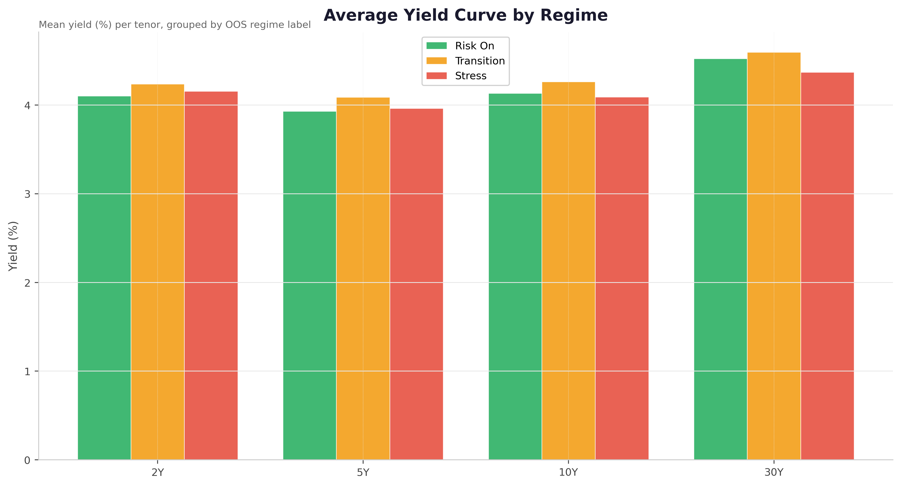

**Chart 4 — 10Y–2Y Slope by Regime**

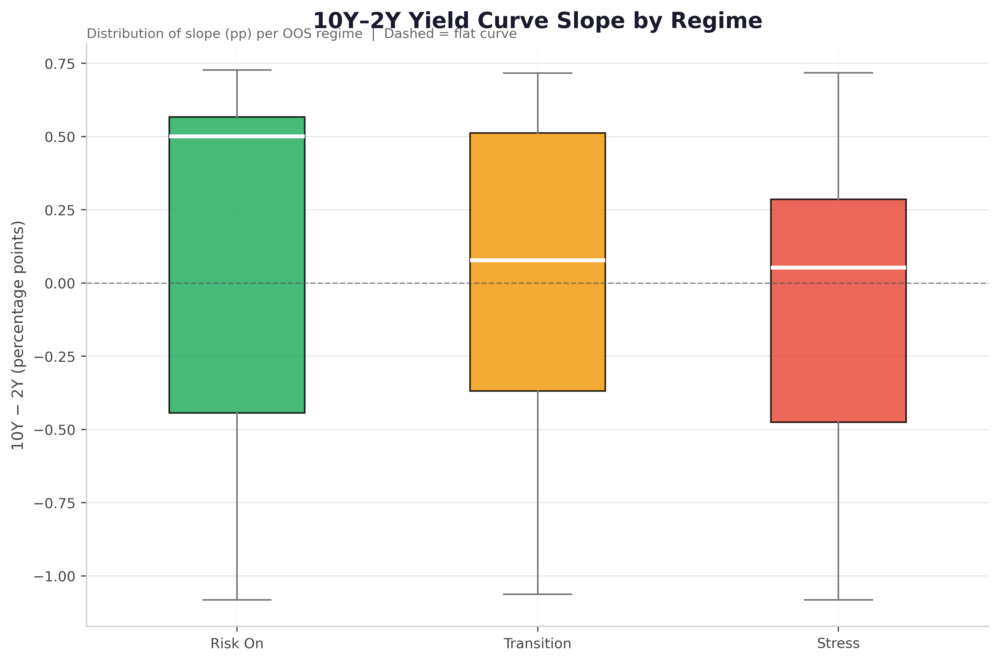
</details>

<details>
<summary>Charts 07–08 — Feature heatmap and latest dashboard</summary>

**Chart 7 — Regime Feature Heatmap**

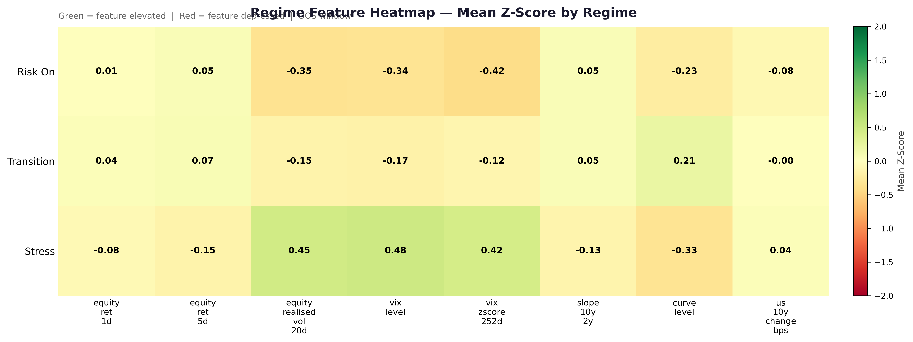

**Chart 8 — Latest Regime Dashboard**

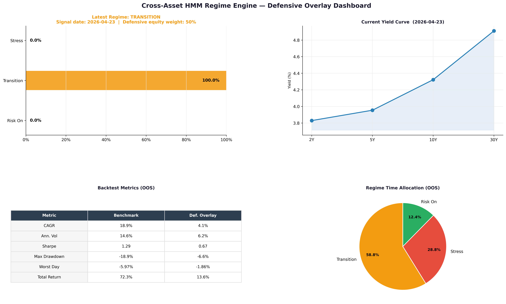
</details>

<details>
<summary>Charts 09–12 — Three-way comparison and bull-aware dashboard</summary>

**Chart 9 — Three-Way Cumulative Returns**

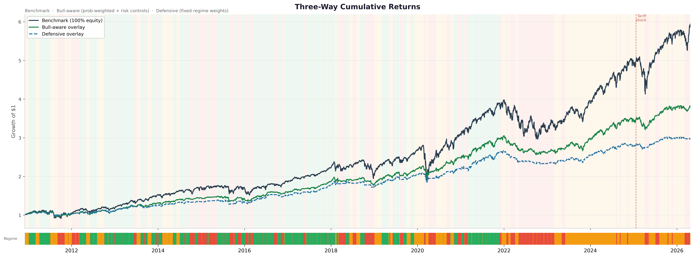

**Chart 10 — Three-Way Drawdown Comparison**

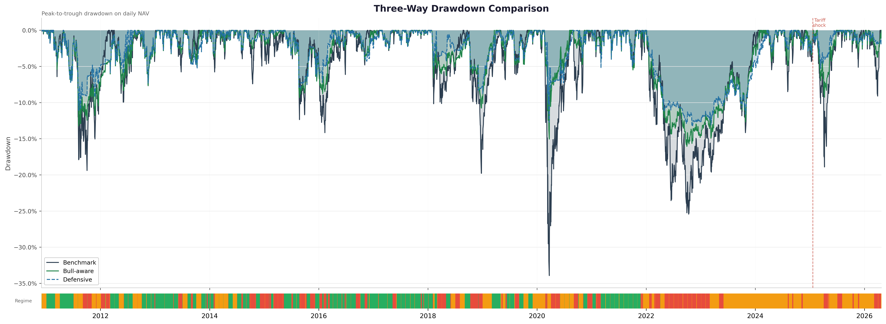

**Chart 11 — Equity Exposure Over Time**

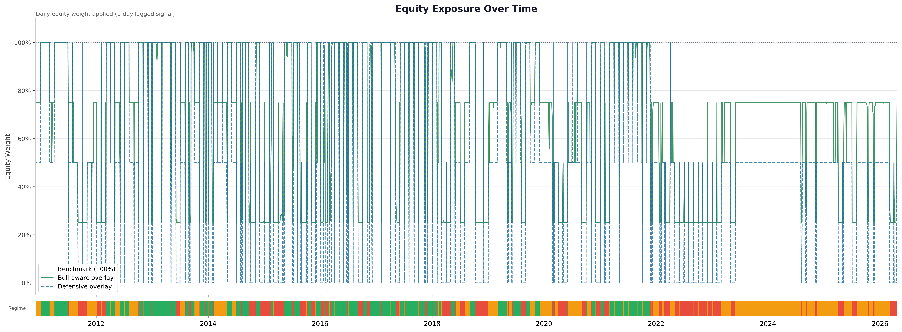

**Chart 12 — Bull-Aware Overlay Dashboard**

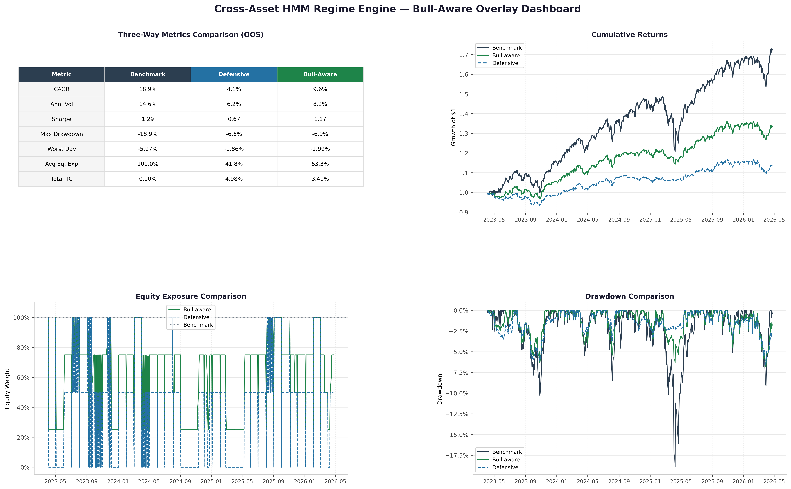
</details>

<details>
<summary>Charts 14–16 — Alpha overlay details</summary>

**Chart 14 — Five-Strategy Drawdown Comparison**

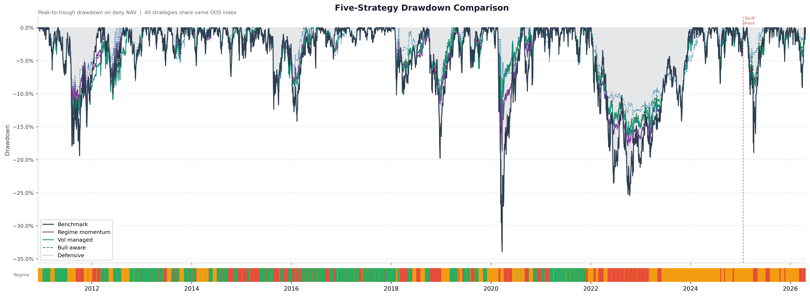

**Chart 15 — Alpha Overlay Equity Exposure**

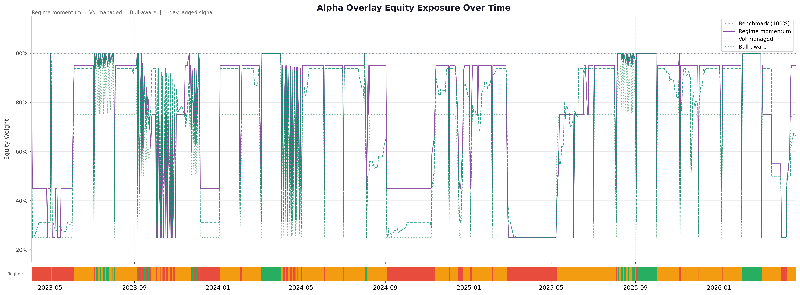

**Chart 16 — Bull-Market Participation by Strategy**

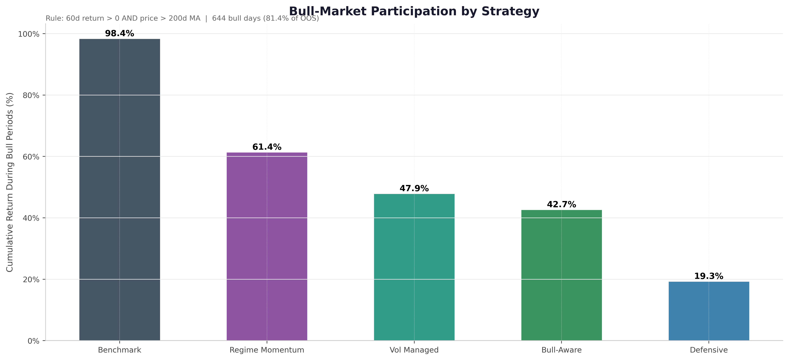
</details>

<details>
<summary>Charts 19 and 21 — PnL distribution and PnL by regime</summary>

**Chart 19 — Daily PnL Distribution**

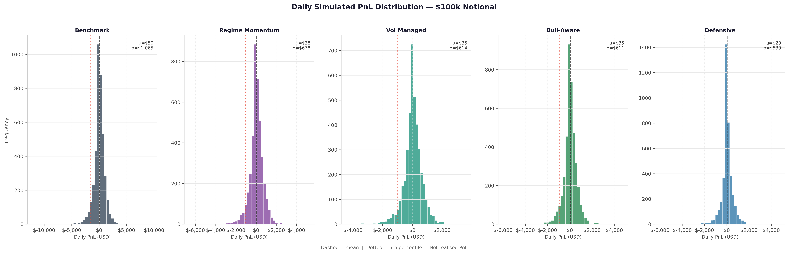

**Chart 21 — Simulated PnL by Regime**

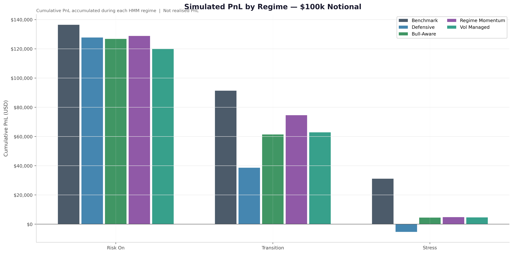
</details>

<details>
<summary>Charts 22–24 — Robustness checks</summary>

**Chart 22 — Transaction Cost Sensitivity**

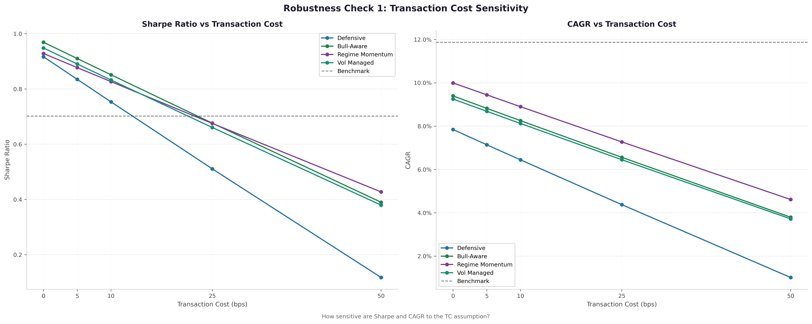

**Chart 23 — Subperiod Performance**

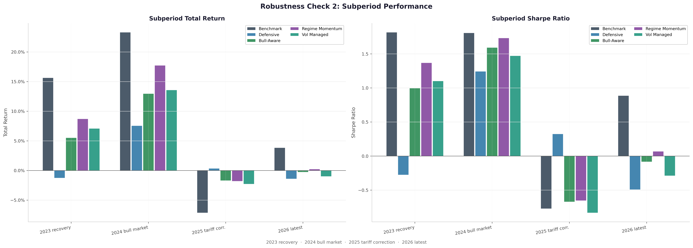

**Chart 24 — Strategy Ranking by Objective**

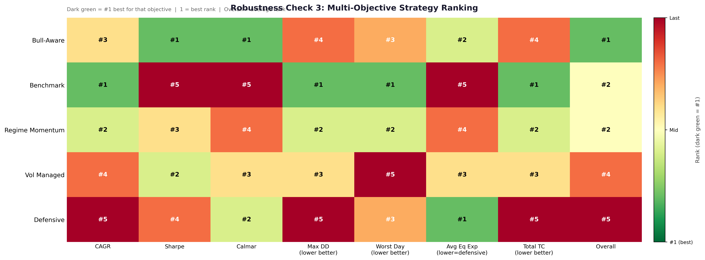
</details>

<details>
<summary>Charts 25–26 — Statistical robustness (Phase 3)</summary>

**Chart 25 — Bootstrap Sharpe Ratio 90% Confidence Intervals**

Shows the p5, median, and p95 bounds for each strategy's Sharpe ratio across 10,000 bootstrap resamples. All strategies have p5 > 0, confirming robustness even in the worst 5% tail of the empirical distribution.

**Chart 26 — Deflated Sharpe Ratio (Bailey & López de Prado, 2014)**

Adjusts for non-normality (fat tails, negative skew) and multiple-comparison bias. All five strategies achieve DSR ≥ 0.96, statistically significant after accounting for high excess kurtosis (4–14).
</details>

<details>
<summary>Charts 27–28 — Professional risk layer (Phase 4)</summary>

**Chart 27 — CVaR by Regime**

Conditional Value-at-Risk (Expected Shortfall, 95% confidence) per strategy × regime. Illustrates that stress-regime tail risk is consistently 2× worse than risk-on, confirming regime labels are economically meaningful.

**Chart 28 — Risk-Controlled Overlay (Vol Target 8%, Stop-Loss, Turnover Cap)**

Cumulative returns after applying all three institutional risk controls (vol scaling, equity-curve stop-loss at ±10%/−5%, max daily weight change 10pp). Red shading indicates stop-loss periods. Turnover cap and vol targeting reduce drawdowns but also cap upside capture.
</details>

---

> **No live trading is performed. The strategy is a research backtest using lagged regime probabilities and simplified transaction costs. Results are not investment advice.**
